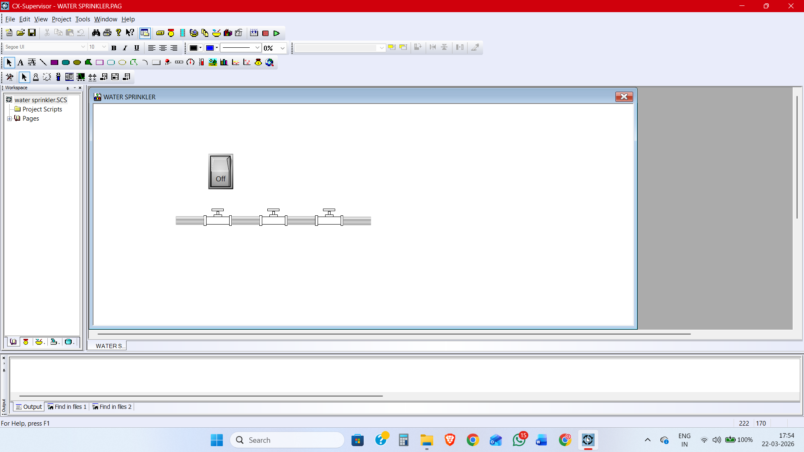
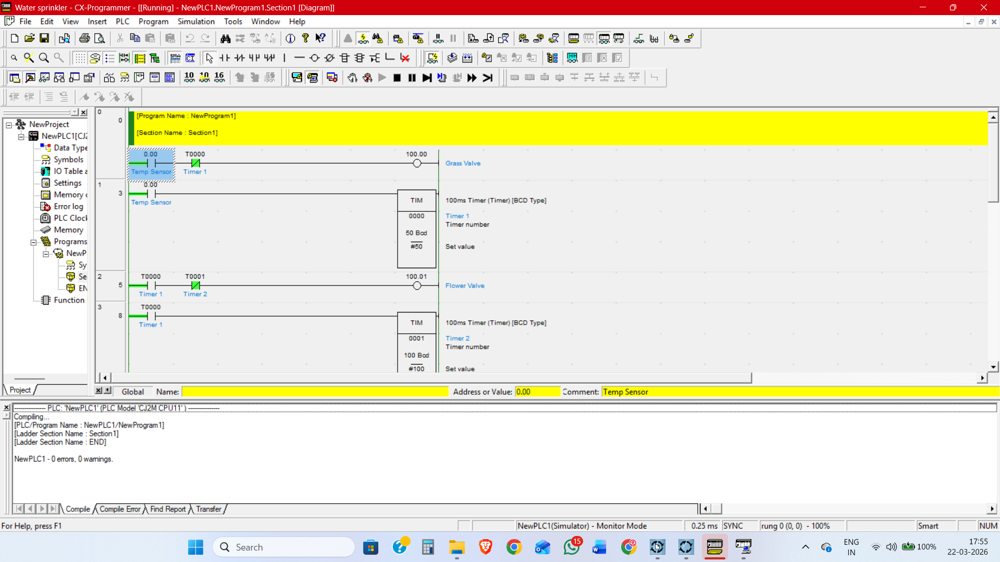

# Water Sprinkler Automation System with SCADA Monitoring

## Overview
This project demonstrates a PLC-controlled water sprinkler system integrated with a SCADA interface for real-time monitoring and control.

The system uses ladder logic programming to automate irrigation using sensor inputs and timers.

## Objectives
* To design and implement an automated sprinkler system
* To control irrigation using PLC ladder logic
* To monitor the system using SCADA
* To simulate industrial automation concepts

## Technologies Used
* PLC Software: CX-Programmer
* SCADA Software: CX-Supervisor
* Programming Language: Ladder Logic
* Simulation Mode: PLC Simulator

## System Components
* Temperature Sensor
* Grass Valve
* Flower Valve
* PLC Timers
* SCADA Control Panel

## Working Principle
1. The temperature sensor activates the system.
2. Timer 1 turns ON the Grass Valve.
3. After Timer 1 finishes, Timer 2 starts.
4. Timer 2 turns ON the Flower Valve.
5. The system stops automatically after the timers complete.

## Ladder Logic Explanation

* Input:
  * Temperature Sensor (0.00)

* Outputs:
  * Grass Valve (100.00)
  * Flower Valve (100.01)

* Timers:
  * Timer 1 (T0000)
  * Timer 2 (T0001)

### Logic
* Sensor ON = Timer 1 starts
* Timer 1 active = Grass Valve ON
* Timer 2 active = Flower Valve ON
* Timer completion = System OFF

## SCADA Interface Features
* Real-time monitoring
* Valve status indicators
* ON/OFF visualization
* User-friendly interface

### SCADA Interface

### Ladder Logic Diagram

## How to Run the Project
1. Open project in CX-Programmer
2. Compile the ladder logic
3. Run PLC Simulation
4. Open CX-Supervisor
5. Load the SCADA file
6. Start monitoring

## Applications
* Smart irrigation systems
* Agricultural automation
* Garden watering systems

## Future Improvements
* Add soil moisture sensors
* Implement IoT monitoring
* Add weather-based automation
